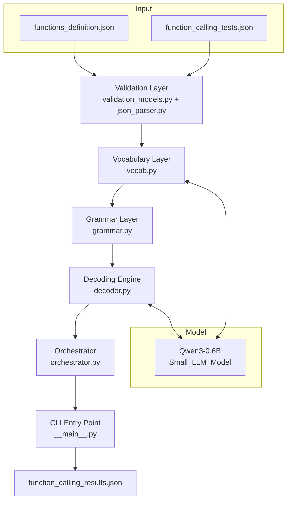
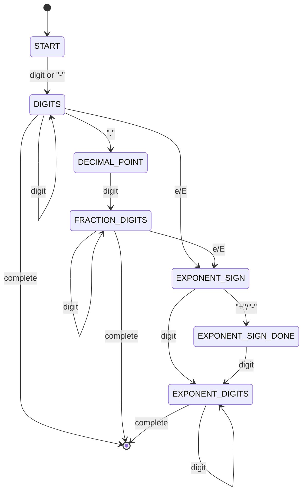
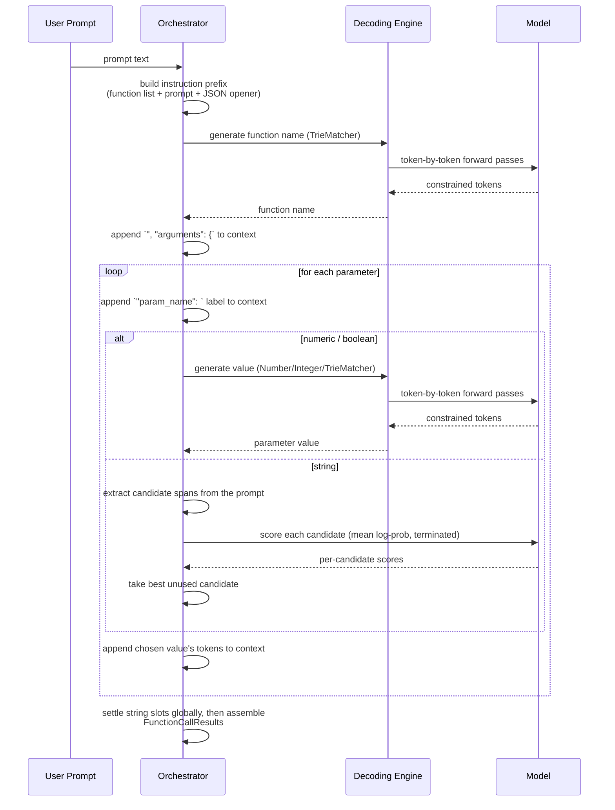
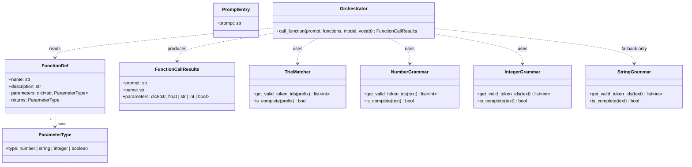
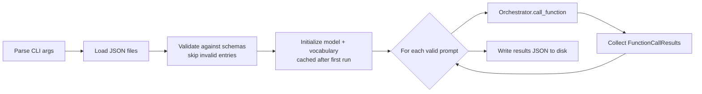

# call_me_maybe — Technical Documentation

## 1. Overview

`call_me_maybe` is a command-line tool that translates natural-language prompts
into structured function calls (name + parameters), expressed as JSON.

The distinguishing constraint of this project is that the language model doing
the translation is intentionally tiny — **Qwen3-0.6B**. A model this small
cannot be trusted to spontaneously emit syntactically correct JSON on its own;
left unconstrained it will hallucinate stray characters, malformed numbers,
unterminated strings, or invalid function names.

Instead of hoping the model gets the syntax right, the system **guarantees**
it through **constrained decoding**: at every single token-generation step,
the set of tokens the model is allowed to produce is restricted to only those
that keep the output on a path toward valid JSON. Tokens that would break
syntax are masked out (their probability is forced to negative infinity)
*before* the model ever gets to choose, so the model is structurally
incapable of producing invalid output — regardless of how small or
under-trained it is.

The model is still responsible for the *semantic* decisions (which function
to call, what values to fill in), but never for punctuation, quoting, or
structure. Those are always either forced by a grammar or written
deterministically by the program itself.

## 2. Core Design Principle

> Never let the model choose freely. Always narrow its choices down to the
> set of tokens that are provably valid at this exact point in the output.

This is implemented as a repeating cycle:

1. Ask the model for its raw next-token probabilities (logits).
2. Ask a **grammar** object which tokens are allowed right now, given
   everything generated so far.
3. Mask every other token's probability to `-∞`.
4. Let the model pick the highest-probability token from what remains.
5. Append it to the output and repeat until the grammar says the value is
   complete.

Because step 3 removes every invalid possibility before step 4's selection
happens, the output cannot deviate from the grammar no matter what the model
"wants" to generate.

## 3. High-Level Architecture

## 4. Module Responsibilities

| Module | Responsibility |
|---|---|
| `arguement_parser.py` | Parses CLI flags: paths to function definitions, input prompts, and output file. |
| `validation_models.py` | Pydantic schemas describing the shape of function definitions, prompts, and results. Acts as the single source of truth for "what does valid input/output look like." |
| `json_loader.py` | Reads JSON files from disk and writes the final results back out, with defensive error handling (missing file, bad permissions, malformed JSON). |
| `json_parser.py` | Validates every loaded function definition and prompt against the Pydantic schemas, discarding invalid entries individually (with a warning) rather than failing the whole run. |
| `vocab.py` | Loads the model's tokenizer vocabulary once, decodes it from BPE byte-level encoding into normal readable text, and builds a lookup index (`first_char_index`) that maps a starting character to every token that begins with it. Cached to disk so this expensive step only happens once. |
| `grammar.py` | Defines the constraint rules ("grammars") that decide which tokens are legal at any given point: matching a fixed function name, building a valid number, or building a valid quoted string. |
| `decoder.py` | The generation loop itself: repeatedly asks the model for logits, asks the active grammar what's allowed, masks everything else, and picks a token — until the grammar reports the value is complete. |
| `orchestrator.py` | Coordinates a full function call: builds the instruction context (available functions + user prompt), drives function-name generation, then drives parameter-value generation one field at a time, threading the growing context between steps. |
| `__main__.py` | Wires everything together: parses args, loads and validates files, initializes the model and vocabulary, runs the orchestrator over every prompt, and writes the results. |

## 5. The Grammar Layer in Detail

Four grammars exist, one per kind of value the model is ever asked to produce.
Each one exposes the same two-method contract, so the decoding engine can work
with any of them interchangeably:

- `get_valid_token_ids(current_text)` — given what has been generated so far,
  return every token id that is legal to generate next.
- `is_complete(current_text)` — has the value reached a valid, finished state?

### 5.1 TrieMatcher — function names

Builds a prefix tree (trie) out of the fixed list of available function
names. At any point during generation, the current prefix locates a node in
the trie; only branches that exist from that node are legal continuations.
This guarantees the model can only ever produce one of the known function
names — never a fabricated one.

Because the tokenizer uses multi-character sub-word tokens (not single
characters), a candidate token is only accepted if walking through *every*
character of that token keeps a valid path through the trie — not just its
first character. This prevents multi-character tokens from jumping the model
onto an invalid branch mid-name.

### 5.2 NumberGrammar — numeric parameters

Modeled as a small state machine that mirrors the JSON number grammar:

At each state, only a specific handful of characters are legal (e.g. only
digits right after a decimal point). A value is considered complete once it
is non-empty and doesn't end on a state that's still expecting more
characters (a trailing sign, a trailing decimal point, a trailing exponent
marker).

### 5.3 IntegerGrammar — integer parameters

The same machine with the decimal point and exponent branches removed: an
optional leading `-`, then digits only. Used when a parameter declares type
`integer`, so the emitted value round-trips through `int()` rather than
`float()`.

### 5.4 StringGrammar — string parameters (fallback)

> Since the parameter-accuracy work, string parameters are normally filled
> by **candidate selection** (§7.3), not by this grammar. `StringGrammar`
> remains as the fallback for the degenerate case where no candidate spans
> can be extracted from the prompt at all.

Also a state machine, mirroring JSON's quoted-string grammar: it tracks
whether it's before the opening quote, inside the string body, in the middle
of an escape sequence (`\n`, `\t`, `\"`, …), or inside a `\uXXXX` unicode
escape collecting exactly four hex digits. The string is complete once a
closing, unescaped quote has been produced.

Because the "inside the string" state legally allows the overwhelming
majority of printable characters, checking every vocabulary token against it
character-by-character on every generation step would be prohibitively slow.
Instead, the set of tokens that are always safe to emit while inside a string
(no backslash, no interior quote) is computed **once** up front, and reused
for the entire run.

## 6. The Decoding Engine

`generate_constrained` is the single implementation of the generation loop
described in section 2. It is grammar-agnostic — it does not know or care
whether it's generating a function name, a number, or a string; it simply
asks whichever grammar it was given what's currently legal.

The loop has four exits, and getting them right was subtle:

- **Dead end.** If the grammar reports that *nothing* is currently legal,
  generation stops immediately rather than continuing to burn model calls.
- **Complete and unextendable.** If the value is finished *and* the grammar
  offers no legal continuation (a string's closing quote was just emitted),
  stop right away. This check costs no model call.
- **Complete, extendable, but the model wants out.** Some states are both a
  legal stopping point and a legal continuation: `1` is already a complete
  JSON number, and unlike a string, a number has no terminator character
  saying more digits follow. Stopping on `is_complete()` alone truncated
  `12345` to `1`. So when the value could end here, the loop inspects the
  model's **unmasked** top choice: if that is still a legal continuation the
  model wants more digits, so keep going; if it has moved on to a comma or
  brace, the value is done. The logits were already fetched, so this is free.
- **Budget exhausted.** A maximum iteration count, plus a repetition guard
  that detects a short token cycle repeating back-to-back and bails out.
  Greedy decoding on a small model can lock into re-emitting the same phrase
  forever; without the guard one prompt burned 318 seconds producing nothing
  useful. Single-token repeats are deliberately *not* treated as a loop, so a
  legitimately repeated digit inside a number is never cut off.

Because the underlying model has no key-value cache, every single generated
token requires a full forward pass over the entire sequence generated so far.
This is the dominant cost driver of the whole pipeline and the reason the
grammars are written to be as cheap as possible per step.

## 7. The Orchestrator: Building One Function Call

A single prompt is turned into a function call in three stages, all sharing
one growing sequence of token ids (`context_ids`) so that later stages can
"see" everything decided in earlier stages:

### 7.1 Why an instruction prefix is needed

Early in development, the model was only ever shown the bare user prompt —
no list of available functions, no framing at all. It had no way to know
what functions existed or what they did, so function selection was close to
random. The fix was to build an explicit instruction block before generation
begins, listing every available function's name, parameter names/types, and
description, followed by the user's actual request and the opening of the
answer (`{"function": "`). This gives the tiny model something
concrete to reason from instead of guessing blind.

The scaffold deliberately says `"function"` and `"arguments"` rather than
`"name"` and `"parameters"`. A prompt containing a template placeholder such
as `{name}` collides with a `{"name": "` scaffold: the model reads the two as
the same thing and starts predicting a *person's* name instead of a function
name. These keys only exist in the text shown to the model — the emitted JSON
keys come from `FunctionCallResults`, so the output format is unaffected.

The prompt is also quote-escaped before being embedded in the `User: "…"`
framing, so a request that itself contains `"` cannot produce a broken,
self-nested quote structure at the exact point the model must tell where the
request ends and its answer begins.

### 7.2 Why context is threaded between stages

Similarly, each generation stage (function name, then each parameter in
turn) is fed the *entire* JSON built so far, not just the original prompt.
Without this, the model generating a parameter value would have no idea
which function it had already committed to, or which parameter slot it was
currently filling in. Threading the growing token sequence through every
stage keeps the model's context consistent with the JSON actually being
constructed.

### 7.3 How string parameters are filled

Every correct string value in this task is a literal substring of the
request — `SELECT * FROM users`, `production`, `latin-1`. So the model is
never asked *"which characters?"*, only *"which span?"*:

1. **Extract candidates** (`_extract_prompt_candidates`): every bare word and
   quoted phrase in the prompt, plus everything after the prompt's last colon
   (which captures `Format template: <the whole rest>` requests, where the
   entire remainder is one value).
2. **Score each candidate** (`_score_string_candidates`) by **mean
   log-probability per token, including its closing quote.** Both details
   matter. Mean rather than total, because total sums a negative per token
   and so mechanically favours short candidates. Including the terminator,
   because otherwise a prefix like `Hello` is scored as if it never had to
   close the string — and it wins over `Hello {user}'s profile!` despite the
   model plainly wanting to continue.
3. **Assign slots globally** (`_assign_candidates_globally`). Filling slots
   left to right lets an early slot take a span a later slot needs far more:
   `utf-8` narrowly outbids the path for `path`, while `encoding` wants
   `utf-8` with near certainty — yielding the two values swapped. Instead,
   the most confident `(slot, candidate)` pairs are assigned first.

This is only revisable after the fact because string values are **selected,
not generated**: there is no token stream to unwind. It also makes
hallucination and repetition loops impossible by construction, and removes
the need for the model to produce JSON escape sequences — a copied span is
escaped correctly by `json.dump` on the way out, which is why Windows paths
like `C:\Users\john\config.ini` now survive intact.

A parameter's own name is excluded from its candidate list, because models
readily echo the key as its own value (`"template": "template"`).

## 8. Data / Class Relationships

## 9. End-to-End Pipeline (CLI Run)

## 10. Key Guarantees and Their Limits

**Guaranteed:**
- Output is always syntactically valid JSON matching the expected schema.
- The function name is always one of the functions actually provided.
- Numbers and strings always conform to JSON's literal grammar (no stray
  characters, unterminated quotes, or malformed numbers).
- String values are always literal spans of the request — the model cannot
  invent characters that were never in the prompt.

**Measured, but not guaranteed:**
Against the ground truth in `data/input/function_calling_corrections.json`
the pipeline currently scores **11/11 function names and 11/11 parameter
sets**, and 3/3 on an unseen function set with different parameter shapes
and type spellings. That is a measurement, not a mechanical guarantee:
- Nothing forces the *correct* function to be chosen for a given prompt.
- Nothing forces the *correct* span to be chosen for a given slot.
- §7.3 assumes the value is a literal substring of the prompt. A request
  needing a *transformed* value (uppercased, computed, or merely implied)
  would fall outside that assumption.

The project's stated requirement was specifically about syntactic
reliability — not spontaneous correctness — so this split is intentional:
the constraint layer owns syntax mechanically, while semantics is steered
(instruction prefix, candidate scoring, global slot assignment) and then
verified by measurement rather than assumed.

## 11. Performance Considerations

- **No KV-cache**: every generated token re-runs a full forward pass over the
  whole sequence so far. This is the single biggest cost in the pipeline.
- **Vocabulary caching**: the tokenizer vocabulary is decoded and indexed once
  and cached to disk (`data/cache/cache.json`), avoiding repeated rebuilds.
- **Precomputed "safe token" sets**: for grammar states that admit a very
  large fraction of the vocabulary (e.g. "inside a string"), the set of
  always-valid tokens is computed once per grammar instance rather than
  re-derived character-by-character on every generation step.
- **Iteration caps, dead-end detection and a repetition guard**: generation
  for any single value is bounded, stops immediately if the grammar ever has
  no valid next token, and bails out if the model locks into repeating a
  short token cycle instead of exhausting the budget uselessly.
- **Candidate scoring is the new dominant cost**: scoring string candidates
  costs roughly `sum(len(candidate_tokens) + 1)` forward passes per slot,
  rather than the single walk a greedy decode would take. A full 11-prompt
  run takes ~3 minutes — inside the 5-minute budget, but this is the main
  thing to optimise first if that budget ever gets tight (e.g. by pruning
  obviously implausible candidates before scoring them).

## 12. Summary

The system treats constrained decoding as a hard boundary: everything that
can be decided deterministically (JSON punctuation, structure, which
characters are legal at a given point) is decided deterministically, and
everything left to the model (which function, which values) is done inside
a fence narrow enough that it cannot escape into invalid syntax. This is
what allows a 0.6B parameter model — far too small to reliably "just get
JSON right" on its own to still produce 100% structurally valid output.
